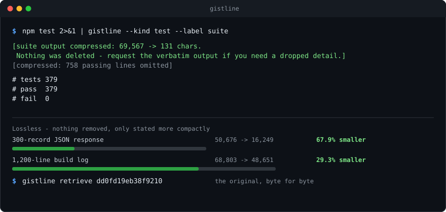

# gistline

**Large output costs tokens. gistline makes it smaller before your AI assistant reads it — and tells you whether
anything was thrown away.**

[](https://www.npmjs.com/package/gistline)
[](#how-it-is-tested)
[](#zero-dependencies-is-the-point)
[](#requirements)
[](LICENSE)

A test suite prints 40,000 characters. A build log prints 200,000. An API response repeats the same six field names
across 300 records. A 12-page PDF arrives as a wall of text with the same header on every page.

All of that goes into a context window and all of it is paid for. Most of it is not information — it is the same shape
repeated, and it can be made smaller **without removing anything**.

[](docs/hero.svg)

*Every number in that image is generated by running the tool. `node make-hero.mjs` regenerates it, and it refuses to
draw a result the code did not produce.*

## Get started in 30 seconds

```
npm install -g gistline     # or skip the install and use npx gistline
gistline install            # register with your AI assistant
```

The second command is the one that matters. It writes the file your assistant already reads, so it starts compressing
large output on its own instead of waiting to be asked.

```
$ gistline install
  created /Users/you/.claude/skills/gistline/SKILL.md

gistline registered with 1 location(s).
Verify with: gistline status
```

**Works in Claude Code, Cursor, Codex, Gemini CLI, GitHub Copilot and 18 more.**
[Pick your platform](#supported-assistants).

Then use it anywhere output is large:

```
npm test 2>&1 | gistline --kind test --label suite     # a command's output
gistline --file build.log                              # a file
gistline --file report.pdf                             # a document, converted then compressed
gistline retrieve <id>                                 # the original, byte for byte
```

---

## See it in action

```
$ npm test 2>&1 | npx gistline --kind test --label suite

[suite output compressed: 69,567 → 131 chars. Nothing was deleted — request the verbatim output if you
 need a dropped detail.]
[compressed: 758 passing lines omitted]

# tests 379
# pass 379
# fail 0
```

The 758 passing lines are gone. **The failures never are** — and the original is retrievable by id, so nothing is
actually lost.

---

## What it actually does

Two stages, and the order is the whole design.

**Stage one restates the content more compactly, removing nothing.**

| Input | What is repeated | Result |
|---|---|---|
| 300-record JSON response | the six field names, 300 times | **67.9% smaller**, every record present |
| Build log, six message formats | the format words, and the timestamps | **67.5% smaller**, every line reconstructible |
| 12-page PDF | the running header, 12 times | stated once, 24 lines of furniture removed |
| Scraped HTML page | markup, scripts, navigation, styling | **95.8% smaller**, all text kept |
| Spreadsheet | column headers per row, XML per cell | **84.6% smaller** end to end, and lossless throughout |

**Stage two removes things — but only from what is left, and only when the budget still is not met.**

A 74,000-character log becomes 24,000 losslessly. If the budget is 4,000, the remainder is then reduced by dropping
ordinary lines and **keeping every error and warning** — which is why the combined path fits **4.7× more of the log**
into the same budget than dropping lines from the start would.

---

## The part that matters most

**Every result says whether anything was removed.**

```
[compressed 96,443 → 2,284: json-tables (lossless), log-templates (lossless)]
```
> Nothing was thrown away. Every value is still there, stated differently.

```
[compressed 96,443 → 2,284: log-templates (lossless), template-rows (LOSSY: 1,400 rows dropped)]
```
> Something was thrown away, and it says how much.

Those two are completely different facts, and a compressor that cannot tell you which one you have is a compressor you
cannot trust with a build log.

**And the original is always recoverable:**

```
gistline retrieve dd0fd19eb38f9210    # the whole thing, byte for byte
gistline slice    dd0fd19eb38f9210 --from-line 400 --lines 50
gistline grep     dd0fd19eb38f9210 "AssertionError"
```

That is what makes aggressive compression safe. The 758 dropped test lines are one command away.

---

## Documents

Most content reaching a model does not start as text. gistline reads it and converts to Markdown first, then compresses
the result — and the two stages compound, because a spreadsheet becomes a table and tables are what stage one is best
at.

| Format | What is read |
|---|---|
| **HTML** | headings, lists, tables, links; scripts, styling, navigation and footers discarded |
| **XLSX** | every sheet as a table, with dates as dates rather than serial numbers |
| **DOCX** | headings, lists, tables, footnotes, hyperlinks; tracked deletions excluded |
| **PPTX** | slide titles and body text in presentation order, plus speaker notes |
| **PDF** | text, tables recovered from alignment, running headers stated once |
| **ZIP** | the archive's contents, listed and extractable |

```
gistline --file report.pdf
gistline --file quarterly.xlsx --budget 4000
gistline --file scraped-page.html
```

**It reads for information, not for reconstruction.** The default assumes you want to know what a document says, so the
output carries the content and drops the presentation — around **25% smaller** on anything with a table. Fonts, colours,
exact positions and page layout are dropped, and the output says so.

Which parts are overhead was measured rather than guessed:

| | Share of output | Kept? |
|---|---|---|
| Table delimiters and padding | **28.7%** | replaced with a dense form |
| Separator row (`\| --- \|`) | 1.4% | dropped — it carries nothing |
| Heading and list markers | 0.6% | **kept** — a heading level is information, and it is nearly free |

```
default (information)          preserve
Region,Revenue                 | Region | Revenue |
North,1200.5                   | --- | --- |
South,980                      | North | 1200.5 |
                               | South | 980 |
```

Both contain every value. The dense form is what a model reads; the pipe form is what a person pastes somewhere.

**Pass `--preserve` when the answer has to go back into a document** — "change this in my PDF", "update the spreadsheet",
"keep the layout". Feeding a document as background information is the common case, and the default serves it.

### Fetching a web page

**Fetch through the shell, not a built-in fetch tool.** A built-in fetch drops the page straight into the conversation
where gistline can never touch it — and scraped HTML is the largest saving available, because only 10–15% of its tokens
are content.

```
curl -sL "<url>" | gistline --label page                    # macOS, Linux
curl.exe -sL "<url>" | gistline --label page                # Windows
(Invoke-WebRequest -Uri "<url>" -UseBasicParsing).Content | gistline    # PowerShell fallback
wget -qO- "<url>" | gistline --label page                   # where curl is absent
```

Only what arrives on stdout can be compressed. The same applies to reading files: `gistline --file <path>` compresses
first, where a built-in file reader loads the whole thing uncompressed.

### What it refuses, and why that is the useful part

```
$ gistline --file scan.pdf
"scan.pdf": PDF 1.4 · 40 page(s) · scanned — no text operators and 40 image draws:
this is a scan and needs OCR. Run it through an OCR tool first and gistline will
compress the result.
```

Every refusal names the format, the reason, and what would fix it:

- **A scanned PDF** needs OCR, which needs a model. gistline stays dependency-free, so it declines and says so.
- **A `.doc`** is a pre-2007 binary container, not a ZIP of XML. Re-save it as `.docx`.
- **An image** cannot be read without OCR — and its token cost is driven by pixel dimensions, so resizing it before
  sending reduces cost directly.
- **An ordinary ZIP** is refused rather than concatenated, because joining forty files produces text that reads
  plausibly and means nothing.
- **A page whose fonts carry no character mapping** is skipped by page number, because the extracted text would be
  glyph ids rather than words.

A converter that always produces *something* produces plausible nonsense on the inputs it cannot handle. Every stage
here can decline, and declining is a successful outcome.

---

## Supported assistants

`gistline install` detects what you have. Name one explicitly with `--platform`, or add `--project` to write into the
repository instead of your user profile.

| Assistant | Command | Mechanism |
|---|---|---|
| Claude Code | `gistline install` | skill + hook |
| Cursor | `gistline install --platform cursor` | always-applied rule |
| Codex | `gistline install --platform codex` | `AGENTS.md` |
| Gemini CLI | `gistline install --platform gemini` | `GEMINI.md` + hook |
| GitHub Copilot CLI | `gistline install --platform copilot` | skill |
| VS Code Copilot Chat | `gistline install --platform vscode` | `copilot-instructions.md` |
| OpenCode | `gistline install --platform opencode` | `AGENTS.md` |
| Aider | `gistline install --platform aider` | `AGENTS.md` |
| Windsurf | `gistline install --platform windsurf` | rule file |
| Kiro IDE/CLI | `gistline install --platform kiro` | skill |
| Kilo Code | `gistline install --platform kilo` | skill |
| CodeBuddy | `gistline install --platform codebuddy` | `CODEBUDDY.md` + hook |
| Factory Droid | `gistline install --platform droid` | `AGENTS.md` |
| OpenClaw | `gistline install --platform claw` | `AGENTS.md` |
| Trae | `gistline install --platform trae` | `AGENTS.md` |
| Trae CN | `gistline install --platform trae-cn` | `AGENTS.md` |
| Hermes | `gistline install --platform hermes` | `AGENTS.md` |
| Kimi Code | `gistline install --platform kimi` | `AGENTS.md` |
| Amp | `gistline install --platform amp` | skill |
| Pi coding agent | `gistline install --platform pi` | skill |
| Devin CLI | `gistline install --platform devin` | skill |
| Google Antigravity | `gistline install --platform antigravity` | rule file |
| Agent Skills (cross-framework) | `gistline install --platform agents` | `.agents/skills/` |

**Shared files are spliced, never overwritten.** `AGENTS.md` belongs to your project — gistline writes a delimited
block and replaces only that block. `gistline uninstall` removes the block and leaves everything else exactly as it
was.

### Automatic prompting, on the platforms that support it

Claude Code, Gemini CLI and CodeBuddy support a **pre-tool hook**, so gistline can speak up at the moment it matters:

```
$ npm test
  gistline: This will likely produce a test suite. Consider piping it through gistline
  so the output arrives compressed:
    npm test 2>&1 | npx gistline --kind test --label <what-ran>
```

**It advises rather than rewrites.** Silently changing your command would mean the thing that runs is not the thing you
asked for, and it breaks on redirections and multi-command lines. The assistant decides.

It only fires on commands that really do produce large output — test runs, builds, installs, `git diff`, container logs —
and stays silent on `ls`, `git status`, and anything already piped through gistline. A hook that fires on everything gets
ignored, and an ignored hook is worse than none.

The hook merges into your existing `settings.json` and leaves the rest untouched. Skip it with `--no-hooks` if you would
rather keep that file to yourself.

```
gistline status       # which files were written, and which assistants read each one
gistline uninstall    # remove from everything detected
```

---

## Commands

```
gistline [--kind K] [--budget N] [--label L]        compress stdin
gistline --file <path>                              compress a file, converting a document if needed

gistline retrieve <id>                              the original, byte for byte
gistline slice <id> --from-line N --lines M         part of the original
gistline grep <id> <pattern>                        search the original
gistline store-stats                                what the store is holding

gistline install [--platform P] [--project]         register with an assistant
gistline uninstall [--platform P] [--project]       remove
gistline status                                     verify what is registered
gistline platforms                                  list all 23 assistants
```

`--kind` overrides content detection: `test`, `log`, `diff`, `json`, `stacktrace`. Detection is usually right; the flag
exists for when it is not.

`--budget` is a character ceiling, default 4,000. A structured result that cannot be safely cut is allowed to exceed it
rather than be corrupted — **being slightly too large is recoverable, being quietly wrong is not.**

### As an MCP server

```
gistline-mcp
```

Exposes `compress`, `retrieve`, `slice` and `grep` over stdio, for assistants that prefer tool calls to shell pipes.

---

## Zero dependencies is the point

gistline installs nothing. No model, no native module, no runtime pinning. That is not minimalism for its own sake —
it is what makes the tool usable as a build gate:

- **Deterministic.** Rules, not a model. The same input produces byte-identical output on every machine, every run.
- **No warm-up.** Nothing to load, so it is fast enough for a pre-commit hook.
- **Works everywhere Node does.** No CPU feature requirements, no Python version to match.

Tools in this space that use a trained model get better compression on prose and pay for it with a large install, a
warm-up, and results that can differ between machines. gistline makes the opposite trade deliberately.

*Want model-quality compression of prose?* Use a tool built for that. This one is for CI.

---

## How it is tested

**379 tests, and the ones that matter assert what was NOT lost.**

Every lossless transform has a reverse function and a round-trip test, because "lossless" is otherwise an adjective
rather than a claim. The round-trips caught bugs that reading the code did not:

- a newline inside a value split the row
- a numeric-looking string came back as a number
- negative zero lost its sign
- values were transposed, because applying patterns in sequence cannot preserve appearance order
- an encoded `null` vanished entirely

Documented limitations are **tested**, so they cannot quietly change. Table compaction preserves every key and value
but not per-row key order — there is a test asserting exactly that, which will fail if someone makes it
order-preserving without updating the documentation.

```
npm test
```

---

## Troubleshooting

**`gistline: command not found` after installing globally**
The npm global bin directory is not on your `PATH`. Either add it — `npm prefix -g` tells you where it is — or skip the
install entirely and use `npx gistline`, which needs no `PATH` change.

**`node --test` finds no tests, or the test script fails on Windows**
Use `npm test`, not the raw command with glob patterns. Shell globs are expanded by the shell, and PowerShell does not
expand them for external commands — so `node --test *.test.mjs` fails on Windows while working on Linux. The `test`
script uses Node's own discovery instead, which behaves identically everywhere.

**`zlib.crc32 is not a function`**
You are on Node 18, or Node 22.0/22.1. `zlib.crc32` arrived in 20.15.0 and 22.2.0 and is used to verify ZIP checksums,
so every ZIP-based format needs it. Upgrade to 20.15 or newer.

**Output got *bigger* after compressing**
It did not compress. gistline declines when it cannot help, and prints the reason — usually that the input is under the
~500-character threshold where the note costs more than the saving. A refusal is a normal result.

**`gistline install` says no assistant was detected**
It only looks for directories an assistant itself created, so it will not guess. Name one: `gistline install --platform
cursor`. `gistline platforms` lists all 23.

**The assistant is not using gistline even though it is installed**
Check `gistline status` first — it reads the filesystem rather than trusting the install command. If the file is there,
the platform may be one where the instruction is guidance rather than an automatic hook; ask the assistant directly to
pipe large output through gistline once, and it will generally keep doing so.

**A document came back as a refusal instead of text**
Read the reason — it names the cause and the fix. A scanned PDF needs OCR; a `.doc` needs re-saving as `.docx`; a page
whose fonts carry no character mapping is skipped by number rather than emitting glyph ids as words.

**A PDF's text is in the wrong order**
Check the notes. Single-column pages follow the page's own order; multi-column order is inferred from the gutter and is
labelled as inferred, because geometry alone cannot resolve interleaved layouts. Genuinely ambiguous pages will be wrong
and will say they might be.

**`gistline retrieve` says the id is unknown**
The store prunes by age and count, so an old id can expire. It defaults to a temporary directory, which some systems
clear on reboot — set `GISTLINE_STORE` to a persistent path if you need originals to survive.

**Compressed output looks right but a value changed**
That would be a bug and worth reporting. Every lossless transform has a round-trip test, so a reproducing input becomes
a test case immediately. See [CONTRIBUTING.md](CONTRIBUTING.md).

---

## Requirements

| | Minimum | Check | Why |
|---|---|---|---|
| **Node** | 20.15 | `node --version` | `zlib.crc32`, used to verify ZIP checksums, was added in 20.15.0 and 22.2.0 |
| Anything else | — | — | Nothing. There are no dependencies to install |

Node 22.0 and 22.1 predate `zlib.crc32` and are **not** supported; 22.2 and above are.

CI runs the full suite on Linux, macOS and Windows across Node 20.15, 22.2, 22 and 24, and verifies the engine floor
holds before running a single test — because a declared floor the code cannot honour is worse than no floor at all.

---

## Releases

Publishing runs from GitHub Actions using **OIDC trusted publishing**, so no npm token is stored in the repository or
in CI. Pushing a `vX.Y.Z` tag triggers the workflow, which runs the full test suite and then publishes with a
**provenance attestation** — a cryptographic link from the published package back to the exact commit and workflow run
that built it.

```
.github/workflows/ci.yml         tests on every push and pull request
.github/workflows/publish.yml    publishes on a version tag, with provenance
```

You can verify any published version came from this repository:

```
npm audit signatures
```

---

## Known limits

Stated here rather than left to be discovered:

- **Logs now compress as well as JSON** — 67.5% against 67.9%, where they used to sit at 29.2%. The gap was structural:
  template extraction removed the repeated format words but a timestamp still had to be emitted, so it *moved* rather
  than shrank. Values are now encoded **column by column** — a column of timestamps becomes deltas, a cycling worker id
  becomes a dictionary reference, a constant log level becomes a run length — and each column's encoding is chosen by
  measuring all of them and keeping the smallest that round-trips exactly.
- **Prose barely compresses at all.** There is no repeated structure to state once. gistline falls back to keeping the
  start and the end, which works and is blunt.
- **PDF reading order is inferred, not declared.** Single-column pages follow the page. Multi-column order is derived
  from the gutter between columns and is labelled as inferred, because it can be wrong in ways that read perfectly.
- **PDF tables are inferred from alignment**, since a PDF records no table structure at all. Suspected merged cells are
  reported rather than guessed at.
- **No OCR bundled.** gistline uses Tesseract if it happens to be installed and refuses cleanly if not — nothing is
  downloaded and the zero-dependency guarantee holds either way. A scanned PDF also needs rasterising first
  (`pdftoppm`), which the refusal says.
- **Extracted text from an untrusted source is untrusted input.** gistline converts and compresses; it does not
  sanitise. A PDF can be built so that extracted text differs from what a human sees on screen, and gistline flags the
  mechanism when it is present but cannot judge intent.

[ROADMAP.md](ROADMAP.md) has what is planned and what is deliberately not.

---

## Contributing

The most useful contribution is a **corpus that compresses badly**. Open an issue with the input and what you expected,
and it becomes a test case.

See [CONTRIBUTING.md](CONTRIBUTING.md). Every lossless transform needs a round-trip test; that is the one rule that
does not bend.

---

## Licence

MIT. See [LICENSE](LICENSE).
